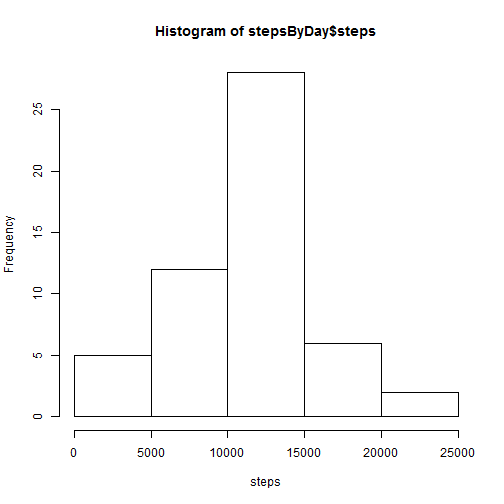
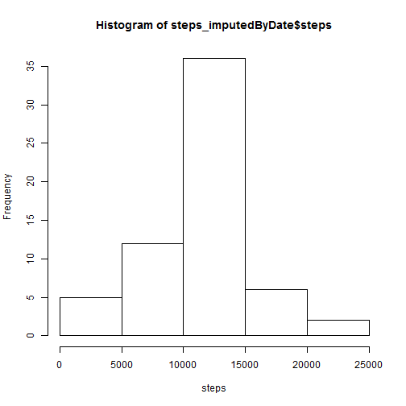

Reproducible Research
=====================
## Course Assignment 1

### Loading libraries

```r
library(lubridate)
library(dplyr)
library(ggplot2)
```

### Loading and preprocessing the data

```r
url <- "http://d396qusza40orc.cloudfront.net/repdata%2Fdata%2Factivity.zip"
download.file(url, destfile="activity.zip", mode="wb")
unzip("activity.zip")
data <- read.csv("activity.csv", stringsAsFactors=F)
data$date <- ymd(data$date)
```

### What is the mean total number of steps taken per day?
First, aggregate the step data by date and show a histogram:

```r
stepsByDay <- aggregate(data$steps,list(data$date),FUN=sum)
names(stepsByDay) <- c("date","steps")
hist(stepsByDay$steps, xlab="steps")
```

 

Then, compute the mean and median of the steps taken per day:

```r
mean(stepsByDay$steps, na.rm=T)
```

```
## [1] 10766.19
```

```r
median(stepsByDay$steps, na.rm=T)
```

```
## [1] 10765
```

### What is the average daily activity pattern?
Aggregate the step data by interval and take the mean:

```r
stepsByInterval <- aggregate(data$steps, list(data$interval), FUN=mean, na.rm=T)
names(stepsByInterval) <- c("interval","steps")
plot(stepsByInterval,type="l")
```

 

Compute the maximum average interval:

```r
arrange(stepsByInterval, desc(steps))[1,]
```

```
##   interval    steps
## 1      835 206.1698
```

### Imputing missing values
Missing (NA) values are imputed by using the average number of steps taken in the corresponding interval.

```r
steps_imputed <- merge(data, stepsByInterval, by.x="interval", by.y="interval")
steps_imputed$steps_imp <- ifelse(is.na(steps_imputed$steps.x), steps_imputed$steps.y, steps_imputed$steps.x)
steps_imputedByDate <- aggregate(steps_imputed$steps_imp, list(steps_imputed$date), FUN=sum)
names(steps_imputedByDate) <- c("date","steps")
hist(steps_imputedByDate$steps, xlab="steps")
```

 

```r
mean(steps_imputedByDate$steps)
```

```
## [1] 10766.19
```

```r
median(steps_imputedByDate$steps)
```

```
## [1] 10766.19
```

### Are there differences in activity patterns between weekdays and weekends?
Create a new column "dayType" containing the type of day (weekday/weekend) as a factor:

```r
steps_imputed$dayType <- as.factor(
  ifelse(weekdays(steps_imputed$date) == "Saturday" | 
           weekdays(steps_imputed$date) == "Sunday", 
         "weekend",
         "weekday"))
```
Aggregate the steps data by dayType and interval and plot a 2-pane graph:

```r
stepsByDaytype <- aggregate(steps_imputed$steps_imp, list(steps_imputed$dayType, steps_imputed$interval), FUN=mean)
names(stepsByDaytype) = c("dayType","interval","steps")
ggplot(stepsByDaytype,aes(interval,steps)) + geom_line() + facet_grid(dayType ~ .)
```

 

